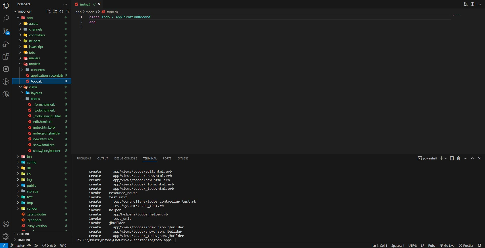
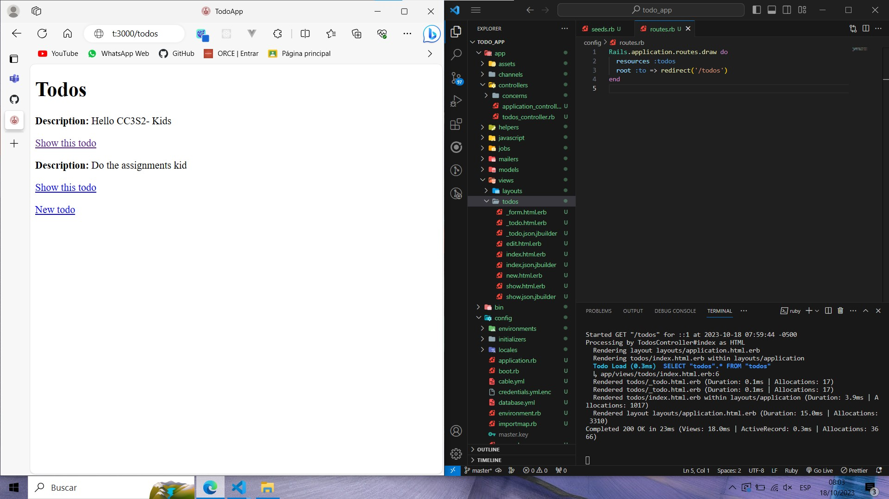
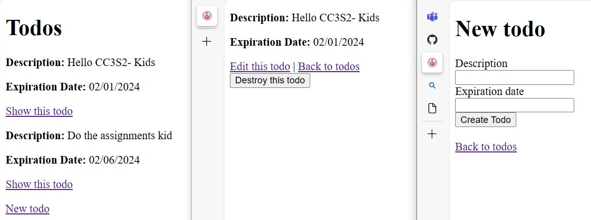
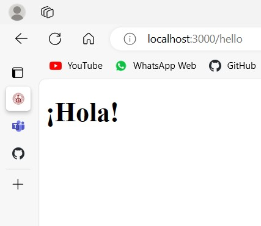

# Parte 2: Introducción a Rails
***
- Creamos la aplicicación rails con el siguiente comando

```Shell
rails new todo_app
```

- Una vez creada la aplicación vamos a crear la clase `To Do` usando rails generate

```Shell
rails generate scaffold todo description:string
```

El entorno nos quedaría así



Donde se visualiza la clase y las vistas creadas por rails generate scaffold así como también el esquema de la base de datos el cual tiene como atributo `description:string`
***
## Base de Datos
- Ahora que tenemos un modelo, creemos una base de datos

```Shell
bundle exec rake db:migrate
```

- Con la base de datos creada vamos a insertar algunos registros en `db/seeds.rb` con las siguientes líneas de código

```Ruby
Todo.create(description: "Hello CC3S2- Kids")

Todo.create(description: " Do the assignments kid ")
```

Para poder verificar que estos 'todos' se hayan añadido correctamente y poder visualizarlos al momento de correr el servidor tenemos que hacer una serie de modificaciones

1. Ejecutamos `rails db:seed` para que reconozca los datos que acabamos de ingresar
2. Modificamos `config/routes.rb` para que nos redireccione al path `/todos` el cual nos muestra todos los `todos`

```Ruby
Rails.application.routes.draw do
  resources :todos
  root :to => redirect('/todos')
end
```

El resultado es el siguiente



- Vamos a añadir a cada 'todo' una fecha de vencimiento asociada. 

1. Lo normal sería añadir el atributo `expiration_date` al archivo `db/migrate` y ejecutar `rake db:migrate` pero rails no funciona así, primero debemos hacer un rolldown con el siguiente comando

```Shell
rake db:rolldown
```

2. Una vez hecho esto recien podemos añadir el atributo de fecha de vencimiento

```Ruby
class CreateTodos < ActiveRecord::Migration[7.0]
  def change
    create_table :todos do |t|
      t.string :description
      t.string :expiration_date
      t.timestamps
    end
  end
end
```

3. Ahora ejecutamos `rake db:migrate` así como `rake db:seed` para asegurarnos que los datos se actualicen. Estos serían nuestros nuevos 'todos'

```Ruby
Todo.create(description: "Hello CC3S2- Kids", expiration_date: "02/01/2024")

Todo.create(description: " Do the assignments kid ", expiration_date: "02/06/2024")
```

4. Por último, para visualizar la fecha que le asignamos modificaremos `app/views/todos/_todo.html.erb` y `app/views/todos/_form.html.erb` para cada que agreguemos un nuevo 'todo' nos pida ingresar la fecha de vencimiento.

- todo.html.erb
```Html
<div id="<%= dom_id todo %>">
  <p>
    <strong>Description:</strong>
    <%= todo.description %>
  </p>
  <p>
    <strong>Expiration Date:</strong>
    <%= todo.expiration_date %>
  </p>
</div>
```

- form.html.erb
```Html
<%= form_with(model: todo) do |form| %>
  <% if todo.errors.any? %>
    <div style="color: red">
      <h2><%= pluralize(todo.errors.count, "error") %> prohibited this todo from being saved:</h2>

      <ul>
        <% todo.errors.each do |error| %>
          <li><%= error.full_message %></li>
        <% end %>
      </ul>
    </div>
  <% end %>

  <div>
    <%= form.label :description, style: "display: block" %>
    <%= form.text_field :description %>
  </div>

  <div>
    <%= form.label :expiration_date, style: "display: block" %>
    <%= form.text_field :expiration_date %>
  </div>

  <div>
    <%= form.submit %>
  </div>
<% end %>
```

El resultado es el siguiente:


***
## Rutas

1. Modificamos `config/routes.rb` para poder añadir nuestra nueva ruta

```Ruby
Rails.application.routes.draw do
  resources :todos
  get '/hello', to: 'todos#hello'
  root :to => redirect('/todos')
end
```

2. Añadimos la vista correspondiente a la ruta en `app/views/todos/hello.html.erb` en donde por el momento solo vamos a escribir `<h1>¡Hola!</h1>`

3. Y por último agregamos el método `hello` dentro de `app/controllers/todos_controller.rb` el cual renderiza nuestra vista

```Ruby
def hello
    respond_to do |format|
      format.html {render :hello}
      format.json {render json: "Hello World"}
    end
end
```
Y esto se visualiza cuando accedemos a [localhost:3000/hello](localhost:3000/hello)


***
## Bonus xd


